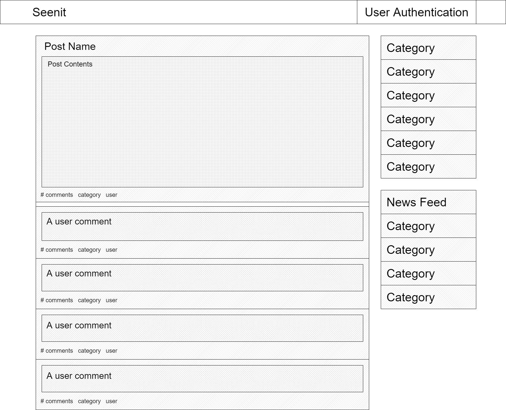
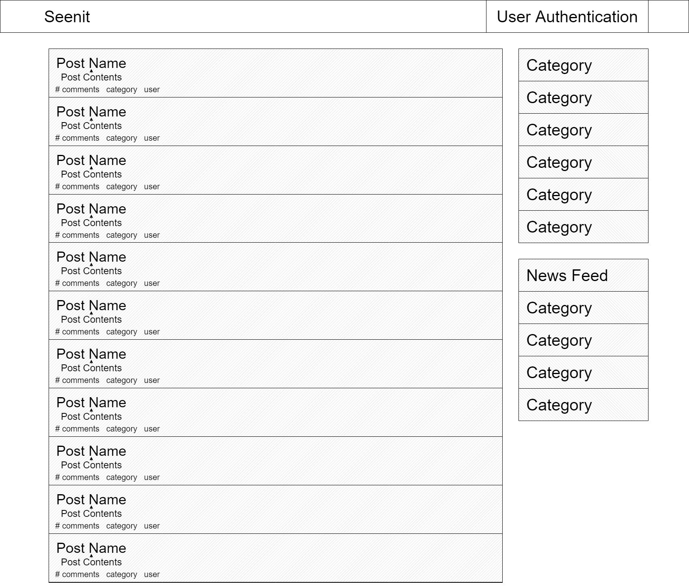
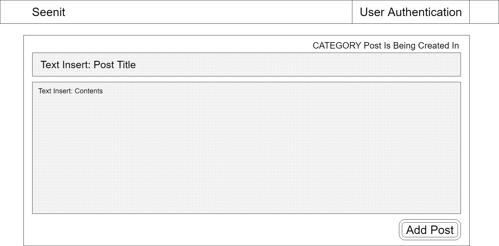

# Seenit

======== User Story ========

1. Seenit is a barebones reddit clone, with basic functionality. Utility will include user authentication, article posting, commenting, and time permitting an upvoting system.

2. The user will open up to the main indexing page, which will automatically display all of the most recent articles, not sorted by category. This is similar to the main landing page of reddit. It is on this page that we can leverage additional API's such as news feeds and local weather. At any point, and on any page the user can decide to create an account and login for read/write capabilities. Users may browse without authentication, but not post or comment.

3. On the right side of the home/index page, there will be a list of sub-categories that the user can navigate too. In these sections, the content will inherently be filtered accordingly. On sub-category pages, users can opt to create a new post or navigate into existing posts.

4. If the user has navigated into an existing post, they will have the option to leave a comment. Icebox feature as previously mentioned is to include an upvoting option that will then move the most liked pages to the top of their respective index pages.

======= Milestones =======

1. Server established with routes and framed MVC

2. Routes created and base view pages

3. Database Schema and relationships established

4. Base functionality

5. API's and Auth implemented

6. Additional stretch goals

======= MVP Pitch =======

The MVP is to have full CRUD functionality in a reddit style setting. Users should be able to create new posts, comment on existing posts, and view various posts in different categories. Additional we would like to have posts filtered by content and general theme.

======= Stretch Goals =======

The main stretch goal is to have a working upvote system that will allow the best comments and articles to be displayed the most prominently among their counterparts. Additional goals include integrating API's for news streams, embedded youtube videos, and google sign-in (among generic user authentication)

